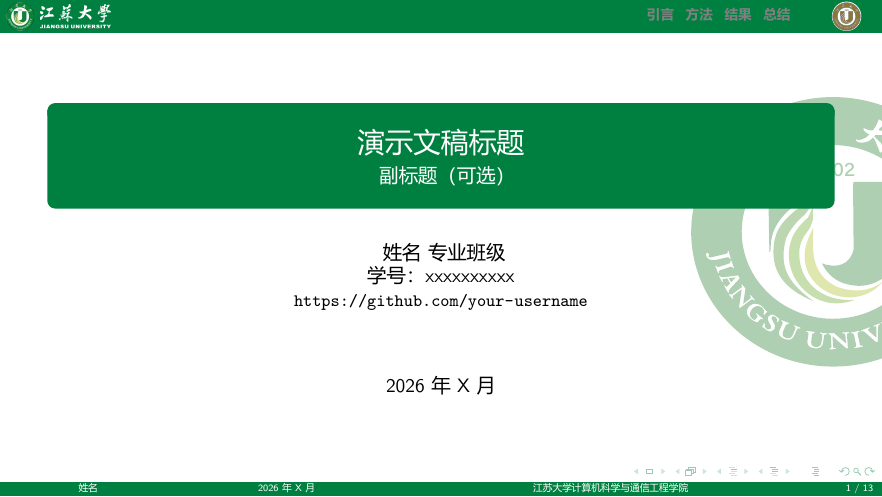
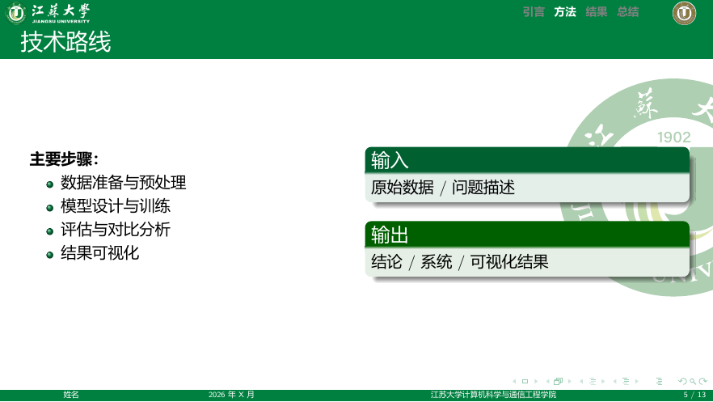

# 江苏大学 Beamer 模板

[English](README_EN.md) | 简体中文

江苏大学学术演示文稿 LaTeX Beamer 模板，提供两种版式，可按场景选用。

| 风格 | 目录 | 特点 | 适合 |
|------|------|------|------|
| **Classic** | [`classic/`](classic/) | 顶栏导航、学院页脚、水印 | 课程答辩、常规报告 |
| **Modern** | [`modern/`](modern/) | 全幅封面、简洁正文 | 开场展示、汇报演示 |

## 预览

### Classic

| 封面 | 内容页 |
|:---:|:---:|
|  |  |

[更多展示](classic/gallery/) · [示例 PDF](classic/example.pdf)

### Modern

| 封面 |
|:---:|
|  |

[示例 PDF](modern/example.pdf)

## 快速开始

```bash
# Classic
cd classic
xelatex example.tex
xelatex example.tex

# Modern（示例为英文，也可用 pdflatex）
cd modern
pdflatex example.tex
pdflatex example.tex
```

Classic 含中文，请用 **XeLaTeX**。更细的说明见各风格目录中的 README。

## 目录结构

```
.
├── classic/          # 顶栏导航风格
├── modern/           # 全幅封面风格
├── LICENSE
└── README.md
```

## 致谢

- Classic 参考 [南京大学软件学院 Beamer 模板](https://github.com/EagleBear2002/NJUSE-Beamer-Template)。
- Modern 参考 [SINTEF Presentation](https://www.overleaf.com/latex/templates/sintef-presentation/jhbhdffczpnx) 与 [college-beamer](https://github.com/liu-qilong/college-beamer)。

## 许可证

本仓库遵循 [MIT License](LICENSE)。使用 Modern 风格时，请一并保留相关致谢。

---

**作者**：徐奕博（通信 2402）  
**学校**：江苏大学  
**更新**：2026 年 7 月
