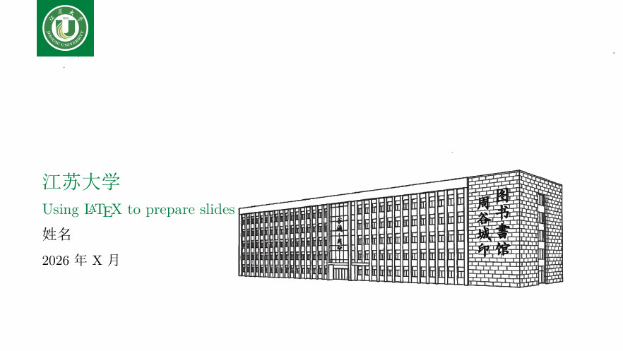

# Modern 风格

全幅封面、左上角校徽、简洁正文页。适合开场展示与汇报演示。

版式参考 [SINTEF Presentation](https://www.overleaf.com/latex/templates/sintef-presentation/jhbhdffczpnx) 与 [college-beamer](https://github.com/liu-qilong/college-beamer)，配色与图标为江苏大学。

## 预览

| 封面 |
|:---:|
|  |

完整示例：[example.pdf](example.pdf)

## 编译

```bash
cd modern
pdflatex example.tex
pdflatex example.tex
# 或：xelatex example.tex
```

示例文稿为英文：

```latex
\usepackage[jsu,en]{collegebeamer}
```

若正文需要中文，可改为 `\usepackage[jsu,zh]{collegebeamer}`，并用 **XeLaTeX** 编译。

## 使用方法

1. 复制 `example.tex` 为你的文稿。
2. 修改 `\title`、`\subtitle`、`\author`、`\date`。
3. 用 `\section{}` 划分章节，用 `\begin{frame}...\end{frame}` 写幻灯片。
4. 封面用 `\maketitle`，致谢页可用 `\QApage`。

### 小提示

- 进入新章节时会出现一页**绿色目录**（高亮当前节），这是本风格的正常设计。
- 每一节下面请放实际内容页，再使用 `\QApage` 结束。

## 替换校徽与封面图

```
resources/
  color-logo.png    # 白底页左上角：主题绿方底 + 彩色校徽
  trans-logo.png    # 绿底页左上角：无底色校徽（便于在绿色上显示）
  background.png    # 封面背景（建议 16:9，右侧图案、左侧留白）
```

替换上述三张图后重新编译即可。

## 目录说明

```
modern/
├── collegebeamer.sty   # 样式
├── resources/          # 校徽与封面图
├── example.tex         # 示例文稿（英文）
├── example.pdf
└── gallery/            # 效果图
```

## 致谢

- [SINTEF Presentation](https://www.overleaf.com/latex/templates/sintef-presentation/jhbhdffczpnx)（Federico Zenith）
- [college-beamer](https://github.com/liu-qilong/college-beamer)（许可见 `LICENSE.college-beamer.md`）
